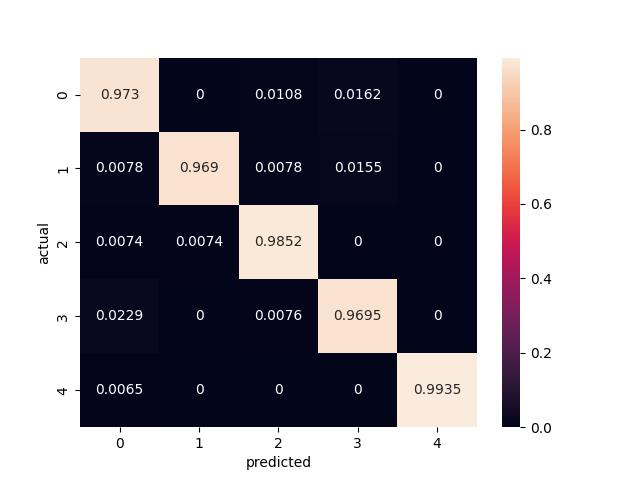
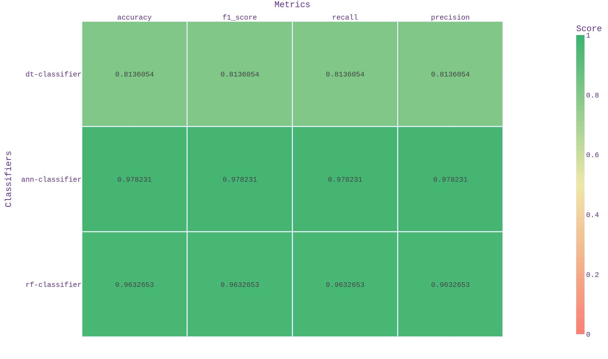

# Text Classification

## Setup project 
Create virtual environment for python3.10 

``
$ python3.10 -m venv ./ 
``

``
$ source bin/activate 
``

Install requirements 

``
$ pip install -r requirements.txt
``
## Train and test models examples 
Run training process with specific dataset file:

``
python train.py -d bbc_text_cls.csv -lc labels -fc text
``

Runs classifiers and evaluation comparing. 
Creates output folder "*bbc_text_cls/*" according to the dataset file name "*bbc_text_cls.csv*".
Saves all generated models and dependencies for preprocessors and classifiers to output folder. 
In output folder you are able to find confusion matrix for each classification method and common evaluation statistic:

Confusion Matrix                     

Evaluation
